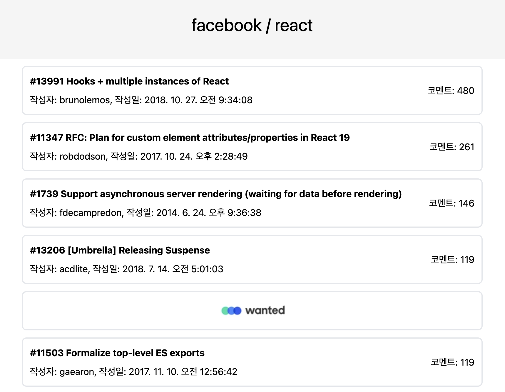
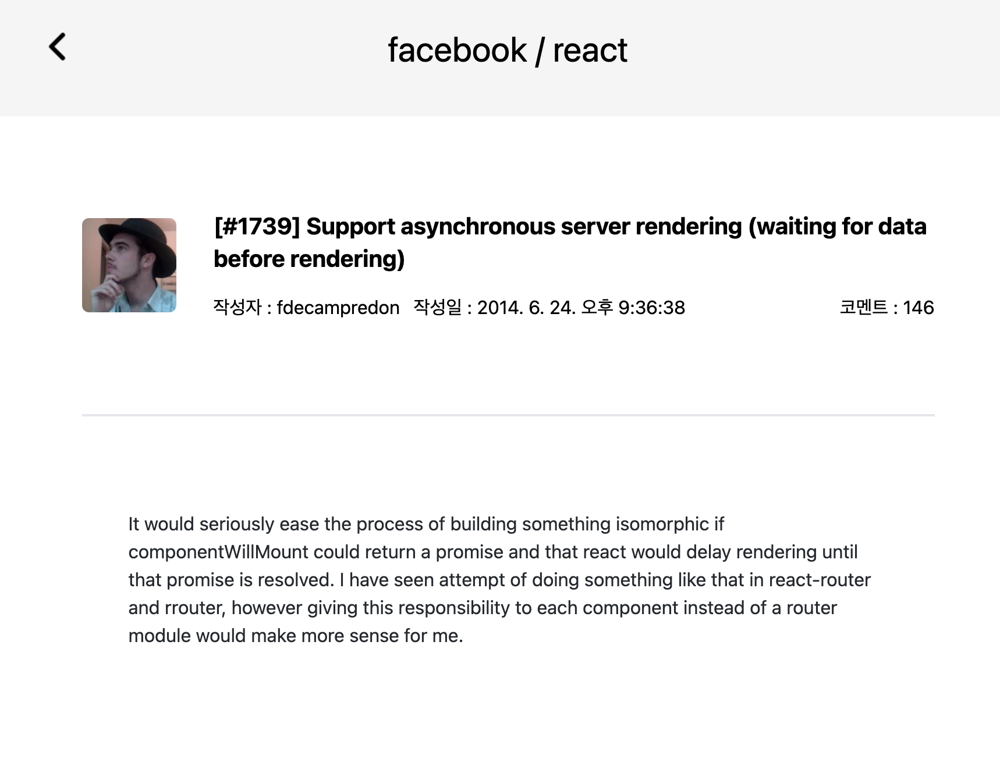

# 원티드 프리온보딩 2주차 - 레포지토리 이슈 목록 확인

## 📚 과제

### Facebook의 React 레파지토리의 이슈 목록과 상세 내용을 확인하는 웹 사이트 구축

#### 과제1. 이슈 목록 화면

- 이슈 목록 가져오기 API 활용
- open 상태의 이슈 중 코멘트가 많은 순으로 정렬
- 각 행에는 ‘이슈번호, 이슈제목, 작성자, 작성일, 코멘트수’를 표시
- 다섯번째 셀마다 광고 이미지 출력
- 화면을 아래로 스크롤 할 시 이슈 목록 추가 로딩(인피니티 스크롤)

#### 과제2. 이슈 상세 화면

- 이슈의 상세 내용 표시
- ‘이슈번호, 이슈제목, 작성자, 작성일, 코멘트 수, 작성자 프로필 이미지, 본문' 표시

#### 과제3. 공통 헤더

- 두 페이지는 공통 헤더를 공유합니다.
- 헤더에는 Organization Name / Repository Name이 표시됩니다.

---

## 사용한 기술 스택

    
 

---

## 🎬 페이지 미리보기

### 메인 페이지 (이슈 목록)

### 상세 페이지 (이슈에 대한 상세한 정보)

## 💭 Best Practice

#### 선정 기준

Best Practice를 선정하기 위한 토의를 통해 팀원들의 공통된 관심사는 아래와 같았습니다.

- 에러 핸들링, Suspense, Loader를 적용법
- 무한 스크롤 구현 방식
- 데이터 전역 상태 관리
- 가독성과 재사용성이 높은 코드

#### 선정된 Best Practice

이러한 기준을 바탕으로 선정된 Best Practice는 크게 4가지 입니다.

1. 에러바운더리를 통한 페이지 별 에러 처리
2. Intersection observer API를 사용한 무한 스크롤 구현
3. Context API의 사용하여 비즈니스 로직 분리
4. 커스텀 fetching 훅 분리를 통한 폭 넓은 사용성

## 🛠️ 설계 및 구현 설명

### Authorization

#### 설계 및 개발 방향

사용자의 로그인 상태를 전역적으로 관리하고, 적절한 페이지 접근 권한을 부여하는 것이 주요 목표였습니다.

- Context API의 사용

  - 상태의 전역적 관리: 여러 컴포넌트에서 접근 가능한 상태를 제공하여 인증 정보를 효율적으로 관리할 수 있습니다.
  - 코드 재사용 및 캡슐화: 인증 관련 로직을 AuthProvider 내부에 캡슐화하므로써 중복을 제거하고 코드의 재사용성을 높였습니다.

- Guard 컴포넌트의 도입

  - TodoGuard: 사용자의 로그인 상태에 따라 적절한 페이지 접근 권한을 부여합니다. 로그인되지 않은 사용자는 Todo 페이지에서 로그인 페이지로 리다이렉션 합니다.
  - AuthGuard: 이미 로그인된 사용자의 로그인 페이지나 회원가입 페이지 접근을 방지하여 불필요한 로그인 절차를 최소화합니다. 즉, 토큰이 이미 있는 사용자는 Todo 페이지로 리다이렉션 합니다.

#### 주요 구성 및 동작

- AuthProvider (src/context/AuthProvider.tsx)

  - 상태 관리: isAuthenticated를 통해 사용자의 인증 상태를 파악하며, loading과 isInitialized 상태로 인증 처리 및 컴포넌트 초기화 상태를 판단합니다.
  - token 관리: 로컬 스토리지에 저장된 access_token을 활용하여 사용자의 로그인 상태를 초기화하거나 업데이트합니다.
  - 인증 함수 제공: login 및 register 함수로 로그인 및 회원가입 기능을 제공합니다.

- TodoGuard (src/guards/Todoguard.tsx)

  - 로그인 상태 확인: 사용자가 로그인 되지 않았을 때 로그인 페이지로 리다이렉션 합니다.

- AuthGuard (src/guards/Authguard.tsx)

  - 로그인된 사용자의 특정 페이지 접근 방지: 로그인된 사용자가 로그인 페이지나 회원가입 페이지에 접근하는 것을 방지합니다. 또한 불필요한 재로그인을 방지합니다.

- Router (src/routes/index.tsx)

  - 라우팅 설정: 프로젝트의 주요 라우팅 경로를 정의하며, 기본 경로 또는 정의되지 않은 경로에 진입 시 Todo 페이지로 리다이렉션 합니다.

- auth (src/utils/auth.ts)

  - 다양한 유틸리티 기능 제공: 토큰 처리, 입력값 검증 등의 기능을 제공하여 프로젝트의 다른 부분에서 재사용 가능하게 합니다.

### TodoList

#### 설계 및 개발 방향

사용자의 데이터를 효율적으로 관리하며, 사용자에게 서버와 동일한 데이터를 보장하는 것이 주요 목표였습니다.

- Context API를 통한 비즈니스 로직 분리

  - 상태 및 액션의 전역 관리 : 사용자의 데이터와 Todo 관련한 동작들을 전역적으로 관리하여 데이터와 관련 로직을 쉽게 재사용하고 변경할 수 있습니다.
  - 서버와의 연동 용이 : 사용자의 데이터가 전역에서 관리되므로 변경사항 발생 시 중앙에서 서버 데이터를 refetch하여 어플리케이션 전반적으로 서버와 동일한 데이터를 가지도록 했습니다.

#### 주요 구성 및 동작

- TodoProvider (src/context/TodoProvider.tsx)

  - 기능에 따른 Context 분리 : '상태'와 '액션'의 두 가지로 나눠 'TodoStateContext'와 'TodoDispatchContext'로 context를 분리했습니다.
  - 서버 데이터 refetching : TodoProvider가 렌더링될 때 혹은 update, delete과 같은 데이터 변경사항이 발생했을 때 서버 데이터를 refetch하도록 로직을 구성했습니다.
